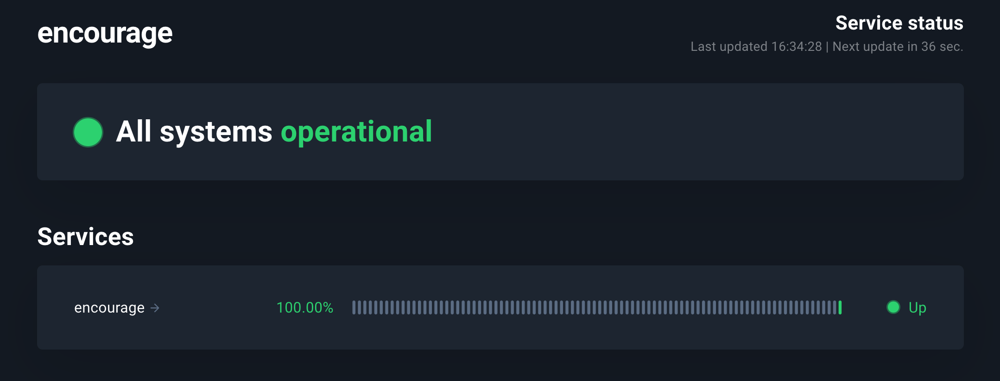

# Encourage Bot
#### ...a Discord Bot with Replit using Python and Flask


### Context:
A recent 

### Commands:
- $inspire
- <plain english sentence with a [sad] word>
- $new <encouraging quote>
- $list
- $del <index>

### Usage:

`$inspire`
```
encourage bot: I've always tried to go a step past wherever people expected me to end up. -Beverly Sills
```

`$new You are brilliant!`
```
```

`$list`
```
```

`$del 0`
```
```

### Service Status


### Reference
[1729-Learn-to-Make-a-Discord-Bot-with-Replit](https://1729.com/replit-discord/)
[w3mone-github-encourage-bot]](https://github.com/w3mone/encourage-bot)
[w3mone-encourage-bot-replit]()
[w3mone-encourage-bot-apps]()
[w3mone-encourage-bot-status](https://stats.uptimerobot.com/wgvgGiL6NG)